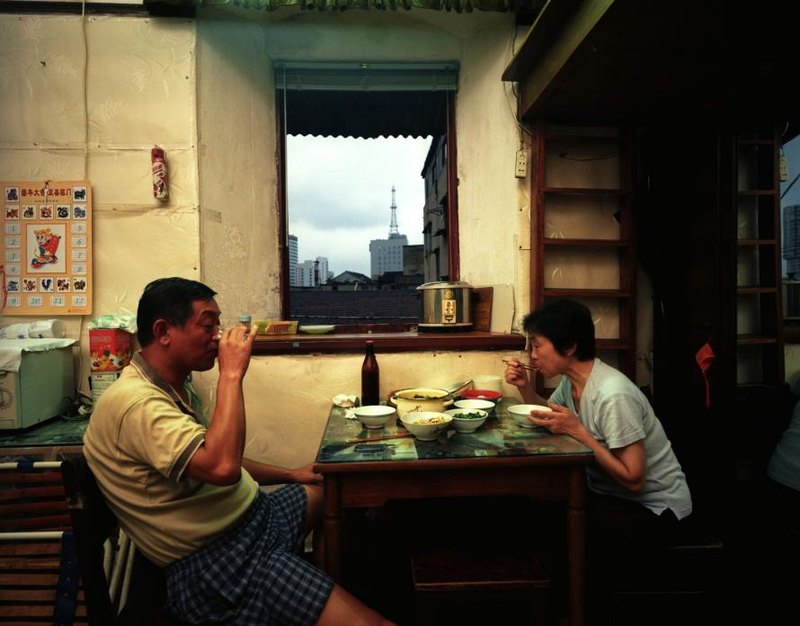
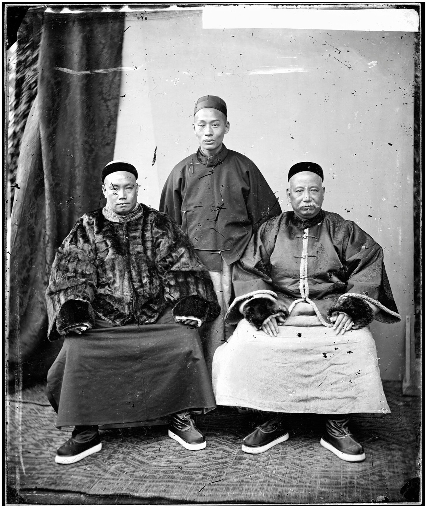
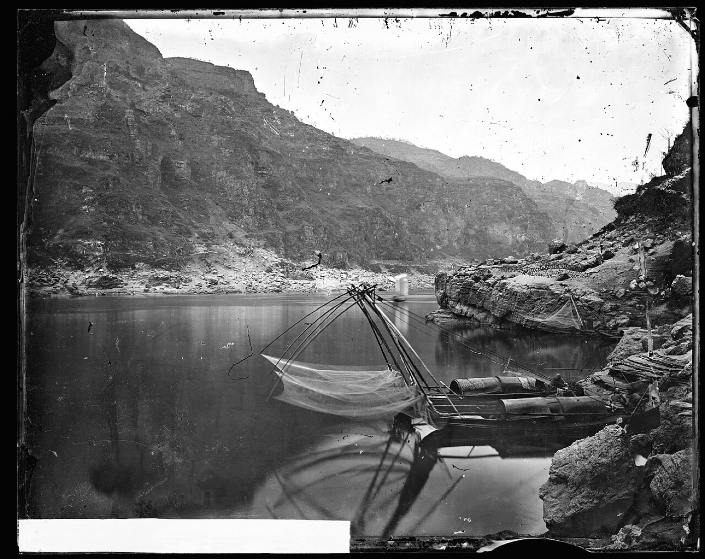
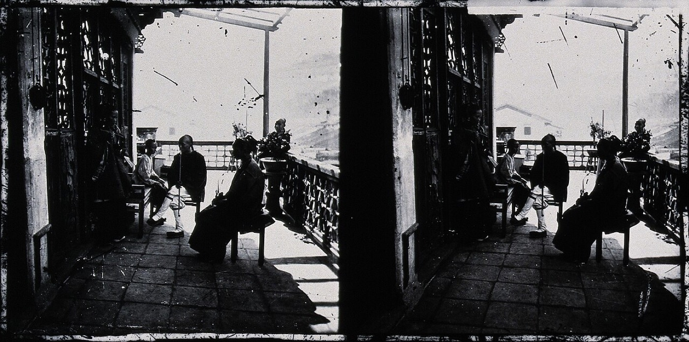
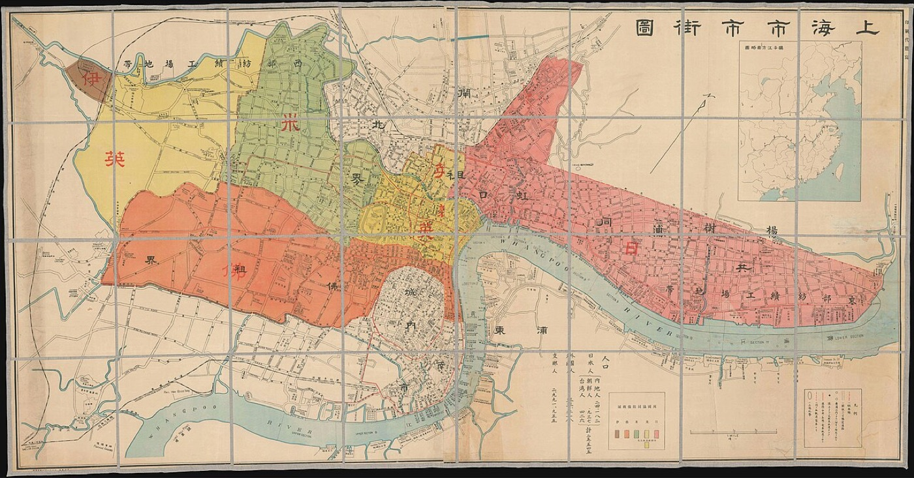
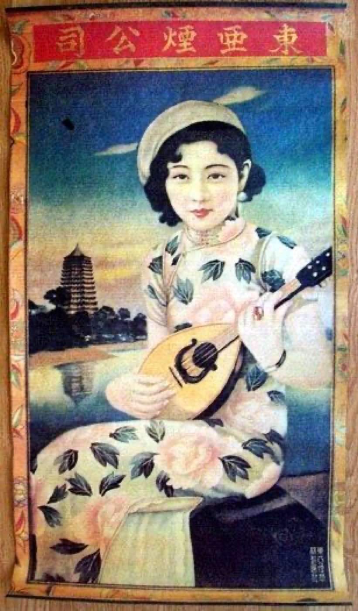
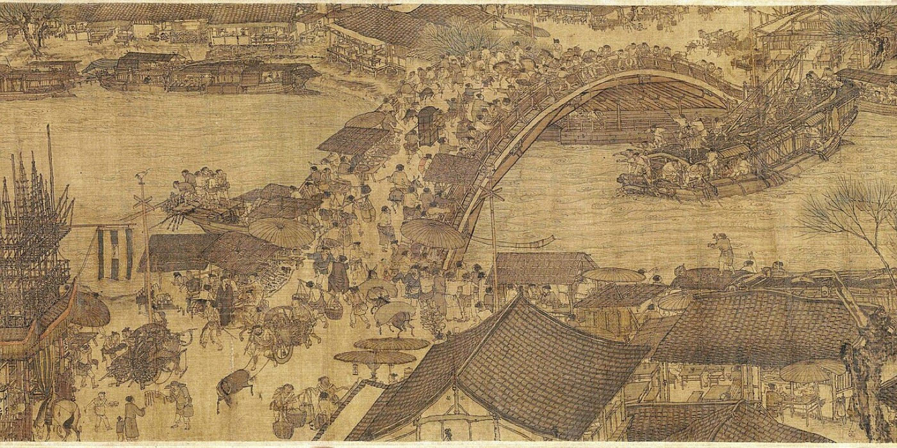

# 中国历史影像资料汇总

**散落在世界各地馆藏里的中国，重新聚到眼前。**

Chinese Historical Visual Resources · 老照片 / 历史地图 / 画报 / 海报 / 图像手稿

[简体中文](README.zh-CN.md) · [English](README.md)

  

*上海室内用餐场景（画面描述） · 摄影 © Greg Girard · 出自 [Phantom Shanghai](https://www.greggirard.com/phantom-shanghai/) · [图片来源与使用说明](assets/IMAGE-CREDITS.zh-CN.md)*

这是一份持续整理的**中国历史视觉资料索引**。我们从世界各地的大学、图书馆、博物馆、通讯社、媒体、非营利项目与摄影师网站中，筛选值得探索的资料入口，配上中文导览、分类和具体示例，方便你前往原站查找与参考。

从清末街景到改革开放，从1990年代的县城到十多年前的日常——寻找那些记录中国的变化影像。

写小说、做游戏、拍影片、找美术参考，或只是想看看过去的中国——从这儿开始。

**如何维护。** 项目维护者有二三十年的媒体、内容生产与编辑经验。AI辅助深度调研用于扩大搜索范围；收录与否、去重、描述，以及力所能及的原站核查，最终均由人来判断。

**两个互补版本。** GitHub提供面向读者的导览、编辑说明与出处记录；[Hugging Face上的双语结构化数据集](https://huggingface.co/datasets/BreadStudio/china-historical-visual-resources-index)则让同一份索引更便于检索、复用和程序化开发。

**27个精选资源与专题 · 6类查找路径 · 中文导览与资料示例**  
持续补充中 · 最近核查：2026-09-16

## 首次访问，可以先看这五个

| 入口 | 特点简介 |
| --- | --- |
| [中国历史照片 HPC](https://hpcbristol.net/) | 从街头小贩到商铺建筑，看历史里具体的人与生活细节。 |
| [夏威夷大学：1987–1988年的中国](https://digital.library.manoa.hawaii.edu/collections/show/95) | 市场、旅馆、硬卧车厢，走进改革开放初期的日常。 |
| [北京银矿](https://www.beijingsilvermine.com/gallery) | 从1985–2005年的民间胶片收藏，寻找普通人的生活记忆；线上提供精选。 |
| [Greg Girard：上海摄影](https://www.greggirard.com/phantom-shanghai/) | 看2000年代上海的街巷、旧房与城市变化。 |
| [Wikimedia Commons：中国2000年代](https://commons.wikimedia.org/wiki/Category:China_in_the_2000s) | 按年份与地点寻找较近的过去，每张图片分别标注来源与许可。 |

## 按分类寻找

- [街头与人物](#street)：商铺、手艺、服饰与日常生活。
- [地方与远行](#places)：云南、四川、青藏地区与地方记忆。
- [建筑与交通](#spaces)：城市街道、铁路、工厂、医院及宫廷陈设。
- [地图与地理](#maps)：旧城、道路、航海图与旅行图册。
- [画报与平面设计](#print)：漫画、宣传画、新闻绘画与时代视觉。
- [更早的中国](#early)：敦煌星图与图像手稿。

每项按主要用途归类，内容可能跨类。精选入口中的重复推荐不计入资源数量；不同专题也不等于不同收藏机构。

## 按年代寻找

| 想找的年代 | 推荐起点与年代线索 |
| --- | --- |
| 1949年以前 | [中国历史照片HPC](#hpc)、[John Thomson](#john-thomson)、[Virtual Shanghai](#virtual-shanghai)、[《时代漫画》](#modern-sketch)。 |
| 1949–1977年 | [中国宣传画](#chinese-posters)的1950年代示例；[《国家相册》](#national-album)可继续按生活主题追查历史照片，具体拍摄年代需逐项辨认。 |
| 1978–1989年 | [夏威夷大学1987–1988年中国照片](#hawaii)；[Greg Girard](#greg-girard)的香港夜生活专题覆盖1974–1989年。 |
| 1990年代 | [北京银矿](#beijing-silvermine)收藏范围为1985–2005年；[香港大学图片数据库](#hku)的馆藏说明延伸至1990年代，具体照片另查日期。 |
| 2000年代 | [Greg Girard](#greg-girard)的上海2001、2002、2005年照片；[Shanghai Street Stories](#shanghai-street-stories)的约2009年莫干山路记录。 |
| 2010年代 | [Wikimedia Commons](#commons)的2018年铁岭校园照片；[ChinaFile](#chinafile)的河流摄影专题含2018年开始拍摄的系列。 |

各资源的具体入口和说明见下方分类。馆藏覆盖某个年代，不表示每一年都有充足资料。

## 街头与人物

  

*广州三位商人，约1869年 · 摄影 John Thomson · [图片来源与使用说明](assets/IMAGE-CREDITS.zh-CN.md)*

### Historical Photographs of China｜中国历史照片

[图库](https://hpcbristol.net/) · [示例：北京篮筐店前的小贩](https://hpcbristol.net/visual/Hv28-20)

**老中国的生活细节** 布里斯托大学维护的历史摄影入口，适合找人物、商铺、建筑、职业和街景。上面的北京小贩示例标为1933–1946年，细到店面与售卖物件都有查找线索。

### MIT Visualizing Cultures｜John Thomson 中国影像集

[专题入口](https://visualizingcultures.mit.edu/john_thomson_china_03/index.html)

**沿着一套十九世纪影像集，看清末的人与街道。** MIT展示1873–1874年出版的四卷《中国与中国人影像集》，底本来自耶鲁大学。适合找服饰、职业与建筑参考；注意出版年与拍摄年不同。

### 北京银矿｜Beijing Silvermine

[项目介绍](https://www.beijingsilvermine.com/about) · [精选图库](https://www.beijingsilvermine.com/gallery)

**历史也藏在普通人的胶卷里。** Thomas Sauvin收集整理的民间底片档案，官方标注收藏范围为1985–2005年。适合寻找家庭、聚会、旅行与消费生活的视觉线索。线上是精选展示，并非全部底片的可检索数据库。

### Wikimedia Commons｜按年代寻找中国影像

[中国2000年代分类](https://commons.wikimedia.org/wiki/Category:China_in_the_2000s) · [示例：2018年铁岭高中学生午餐](https://commons.wikimedia.org/wiki/File:A_student_having_lunch_in_Tieling_High_School.jpg)

**十多年前的校园、街道与日常，也值得留下一份坐标。** 社区维护的图片库，可沿年份、地点与主题分类继续查找。示例记录拍摄于2018年5月29日，文件页标注CC BY-SA 4.0；其他图片需分别查看日期、来源与许可。

### 新华社｜国家相册

[栏目与分集目录](https://www.xinhuanet.com/video/gjxc/index.htm)

**从赶集、个体户、流行色，找回生活变化的细节。** 以中国照片档案馆历史照片为基础的微纪录片栏目，目录可找到《走，咱赶集去》《我是个体户》《那年流行色》等主题。适合发现选题和历史照片线索；属于编辑后的专题，不是原始照片检索库，影片播放尚未实测。

## 地方与远行

  

*珠江上的渔船与山峡，1870年 · 摄影 John Thomson · [图片来源与使用说明](assets/IMAGE-CREDITS.zh-CN.md)*

### Harvard｜Joseph F. Rock 洛克摄影收藏

[收藏介绍与在线浏览入口](https://library.harvard.edu/collections/joseph-f-rock-collection)

**把目光从沿海城市，转向西南与西北。** 哈佛收藏的洛克历史照片涉及云南、四川、甘肃及西藏等地，适合寻找地方人物、考察活动与自然环境。

### The Tibet Album｜西藏相册

[项目入口](https://tibet.prm.ox.ac.uk/)

**按人物、地点和相册，走进1920–1950年的西藏影像。** 牛津大学Pitt Rivers Museum与British Museum合作项目，适合地方环境、人物与历史旅行参考。

### UW–Madison｜东亚数字馆藏

[East Asian Collection](https://search.library.wisc.edu/digital/AEastAsian)

**为中国老照片和明信片多留一扇检索窗口。** 威斯康星大学麦迪逊分校的东亚数字馆藏，可以继续寻找中国相关视觉材料；馆藏范围也包括其他东亚地区。

### 台湾记忆

[检索入口](https://tm.ncl.edu.tw/index)

**从一个地方、一段时间，追索台湾的历史记忆。** 地方史与数字典藏入口，可继续寻找老照片、明信片等资料，适合城市与生活史选题。

### 夏威夷大学马诺阿分校｜1987–1988年中国照片

[收藏目录](https://digital.library.manoa.hawaii.edu/collections/show/95) · [示例：1988年硬卧车厢](https://digital.library.manoa.hawaii.edu/items/show/53292)

**把1980年代的日常，细化到一节硬卧车厢。** Michael A. Chopey两次中国陆路旅行的照片，目录包含市场、食物、旅馆、交通和城镇生活，地点涉及上海、福建、广东、云南等地。硬卧示例记录为1988年，条目标注CC-BY，其他资料按各自页面查看。

### Ian Teh｜Undercurrents

[摄影项目与图说](https://www.ianteh.com/undercurrents-1)

**把视线移到边境城镇，看世纪之交的中国。** 作者说明这五组中国故事拍摄于1999–2008年，图说涉及图们、珲春、绥芬河、东宁等地的住宅建设、餐饮、娱乐与跨境生活，也涉及三峡地区的变化。适合补充大城市之外的环境参考；这一时间范围属于整个项目。

### ChinaFile｜河流与生活摄影专题

[Living by the Rivers](https://www.chinafile.com/multimedia/depth-of-field/living-rivers)

**沿着河流，找2010年代中国的生活切面。** 这篇2019年发布的摄影导览串联多位摄影师的项目，其中包含2018年开始拍摄的系列。适合继续发现地方生活与社会变化的纪实摄影；部分作品需要跳转作者网站，文章发表年份不等于全部照片的拍摄年份。

### 香港大学｜香港图片数据库

[Hong Kong Image Database](https://digitalrepository.lib.hku.hk/hkimage)

**看香港，也看村落、渔业、住房与基础设施。** 香港大学馆藏说明覆盖1840年代至1990年代，题材包括人物、乡村、农业、渔业、工业与城市建设。适合按地点和生活主题继续检索，具体照片的年代及访问条件以条目为准。

## 建筑与交通

  

*香港中式茶楼，约1868年 · 摄影 J. Thomson · [图片来源与使用说明](assets/IMAGE-CREDITS.zh-CN.md)*

### Virtual Shanghai｜虚拟上海

[项目介绍](https://www.virtualshanghai.net/Presentation/Overview) · [示例：苏州河方向的礼查饭店](https://www.virtualshanghai.net/Photos/Images?ID=1)

**让老照片里的建筑，在地图上有一个位置。** 上海历史照片、地图及城市研究资料，适合找街道、交通、建筑与空间关系。上面的礼查饭店条目可以作为起点。

### 华北交通数据库

[检索入口](https://codh.rois.ac.jp/north-china-railway/) · [中文公开宗旨](https://codh.rois.ac.jp/north-china-railway/announcement/index.html.zh-cn)

**沿铁路与车站，寻找华北城市和沿线风物。** 以京都大学所藏摄影资料为基础，可按拍摄年月、车站与标签检索。资料含战时宣传摄影；部分检索标签及说明为后加AI内容，应与原始记录区分。

### Wellcome｜北京协和医学院建筑档案

[1922年档案及查看入口](https://wellcomecollection.org/works/pf63heps)

**小而具体的建筑参考：一所医院如何被记录。** 1922年的北京协和医学院历史与建筑档案，页面列有29幅数字图像。适合查医疗机构空间，来源标注CC BY-NC 4.0。

### MIT｜慈禧与摄影

[图文专题](https://visualizingcultures.mit.edu/empress_dowager/cx_essay02.html)

**看清宫形象，细到首饰、屏风与座椅。** MIT的慈禧摄影图文专题适合人物造型和陈设参考；这里的摄影布景需要与日常生活空间区分。

### Greg Girard｜上海与香港摄影

[作者网站及照片图说](https://www.greggirard.com/) · [Phantom Shanghai](https://www.greggirard.com/phantom-shanghai/)

**记忆中的城市，可能只隔着一次拆迁。** 作者网站列有上海愚园路2001年、复兴路拆迁2002年及2005年街巷照片，适合找2000年代的旧房、街道与城市变化。另有HK:PM香港夜生活专题，范围为1974–1989年。属于摄影师作品选集。

### Shanghai Street Stories｜上海街区记录

[示例：莫干山路的时光切片](https://shanghaistreetstories.com/?p=8941)

**城市变化，常常从一堵墙、一间小店开始。** 街区图文记录适合寻找上海巷弄、居民与拆迁变化。莫干山路这篇文章发表于2015年，其中明确回顾约2009年的照片；使用时要区分文章日期、回访时间与拍摄时间。

### Edward Burtynsky｜China

[中国摄影系列](https://www.edwardburtynsky.com/projects/photographs/china)

**除了街巷，还有塑造城市的工厂与工地。** 作者的中国系列按制造业、旧工业、回收、船厂、城市更新与三峡等主题展开，适合找工业空间、生产环境和大规模建设参考。页面以作品展示为主，具体照片年代需另查作品记录。

## 地图与地理

  

*1932年上海市街图 · Jichisan Shokai · [图片来源与使用说明](assets/IMAGE-CREDITS.zh-CN.md)*

### David Rumsey｜中国历史地图

[中国相关地图与图像目录](https://www.davidrumsey.com/luna/servlet/view/all/where/China)

**给你的历史场景，找一张旧地图。** 已筛选中国相关内容，可按年代、作者与类型继续找地图、航海图、地图集和探险出版物。

### 东洋文库珍本数字档案

[档案入口](https://dsr.nii.ac.jp/toyobunko/index.html.en) · [示例：《Atlas von China》第一卷第43页](https://dsr.nii.ac.jp/toyobunko/Lc-39/V-1/page/0043.html.en)

**把地图与旅行图册一起翻。** NII Digital Silk Road与东洋文库的珍本数字档案包含中国及丝路资料。示例页列有高分辨率和PDF入口，适合继续追查图册细节。

### 老北京数字地图

[专题入口](https://dsr.nii.ac.jp/beijing-maps/concept/index.html.en)

**一座北京城，放在不同时代的图与照片里看。** 专题关联乾隆京城全图、北京地图及摄影图册，适合找城墙、道路与街区关系。与东洋文库同属Digital Silk Road平台。

## 画报与平面设计

  

*东亚香烟公司月份牌广告，约1930年 · East Asian Cigarette Company · [图片来源与使用说明](assets/IMAGE-CREDITS.zh-CN.md)*

### MIT｜《时代漫画》

[1934–1937年图像目录](https://visualizingcultures.mit.edu/modern_sketch_03/index.html)

**把1930年代的都市气息，翻成一页页可看的图像。** 上海出版的《时代漫画》列有1934–1937年39期入口，关联Colgate University馆藏，适合漫画、刊物版式和人物表现参考。

### MIT｜《点石斋画报》专题

[专题入口](https://visualizingcultures.mit.edu/dianshizhai/index.html)

**看晚清的人，怎样把新闻画出来。** MIT的《点石斋画报》专题提供清末上海新闻绘画与研究导读，适合印刷视觉和城市想象参考。是专题选编，并非全刊数据库。

### Chinese Posters｜中国宣传画

[网站](https://chineseposters.net/) · [示例：《劳动模范妇女屏（二）》](https://chineseposters.net/posters/e14-998)

**寻找一个时代的颜色、人物形象与宣传语言。** 可按人物、劳动、农业等主题查找宣传画，补充1949年后的视觉材料。上面的1950年代早期示例附有设计者、出版者与馆藏信息。

## 更早的中国

  

*《清明上河图》桥段，北宋 · 归于张择端 · 故宫博物院藏 · [图片来源与使用说明](assets/IMAGE-CREDITS.zh-CN.md)*

### 国际敦煌项目｜International Dunhuang Programme

[数字馆藏](https://idp.bl.uk/collection/) · [示例：敦煌星图 Or.8210/S.3326](https://idp.bl.uk/collection/7861395E5F814419BA05483EAB254832/)

**把时间再往前翻，看到纸上的星空。** 国际敦煌项目为敦煌及丝路图像手稿提供检索入口。星图示例适合了解早期科学图示与手稿视觉，具体定年应查看原站及研究说明。

## 待确认资源：留下线索，继续补齐

还有**24项资源线索**见[更多资源与待确认说明](MORE-RESOURCES.zh-CN.md)，包括甘博摄影、Magnum中国摄影、民间交通相册与独立纪录片档案。后续会继续核查、更新，适合的资源会移入精选清单。

这里的“待确认”有几种情况：**照片或作品已有线索，但年代、地点待核对；具体条目本次打开受阻；只有馆藏介绍，还没定位到中国照片；或下载、许可、影片播放尚未核实。** 每项分别说明，不把“暂时没打开”写成“没有资料”。仅缺单张年代或开放许可的资源，也可能作为浏览入口收录，并注明限制。

## 为什么整理这份清单

如果要还原一条民国街道，除了建筑，我们还需要知道什么？

店门口挂着怎样的招牌，行人穿什么，街边摆着什么，车站和商铺又是什么样子。真正让一个场景可信的，往往是这些不起眼的细节。

带着这样的创作问题，我们开始寻找中国历史视觉资料。AI很擅长帮人发现线索，但找到之后，仍要打开原站、辨认出处，区分可以浏览的馆藏和暂时无法访问的页面。

资料逐渐积累起来，我们觉得，与其让这些入口散落在聊天记录和收藏夹里，不如把它们串起来：配上中文介绍，按用途分类，方便自己以后找参考，也分享给有同样需要的人。

于是有了这份清单。希望你下一次需要寻找过去的中国时，可以少绕一些路。

### 调研与编辑过程

本项目的选题讨论、资料整理与README编辑在Codex中与GPT-6 Astra协作完成；Gemini 3.1 Pro与GPT-5.6 Sol辅助进行深度调研。最终收录与编辑判断由维护者做出。收录资源经过筛选、去重与部分原站复查，检查范围及限制见[核查记录](ACCESS-NOTES.zh-CN.md)。

## 关于这份清单

清单以原始来源链接为主，配少量图片帮助读者浏览。配图来源与使用状态见[图片说明](assets/IMAGE-CREDITS.zh-CN.md)；图片权利归各自权利人，不随本索引自动授予使用许可。使用原站资料时，请查看对应条目的说明。

## 一起把过去找回来

如果这份清单帮你找到了资料，欢迎 **Star收藏**，下次需要时更容易找到，也欢迎分享给正在找参考的朋友。

有私藏的好入口？欢迎提交Issue或PR，附上资源名称、内容简介、原站链接和一个可查看的资料示例。失效链接、描述错误，也欢迎指出。

我们尤其想继续补齐：**1950–1980年代日常摄影、内陆县镇生活、历史广告与商品图录，以及能实际播放的早期影片。**
